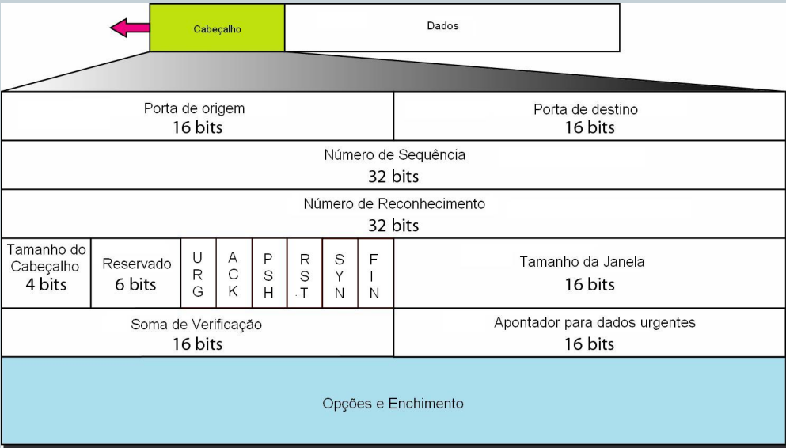

# Camada de Transporte
Serviço de comunicação host to host

## multiplexação e demultiplexação

multiplexação => aceita mensagens de vários processos 
Multiplexing is the process of combining multiple data streams into a single stream for transmission over a shared medium or connection.

demultiplexação => transporte entrega mensagens para vários processos
Demultiplexing is the reverse process of multiplexing. It involves extracting multiple data streams from a single stream received over a shared medium or connection.

## Paradigma cliente servidor 

Transport Protocol Data Units => T-PDUs are the logical data units handled by the transport layer.  

The specific structure and contents of T-PDUs depend on the transport protocol being used. For example, in TCP (Transmission Control Protocol), T-PDUs are called segments, while in UDP (User Datagram Protocol), they are referred to as datagrams. Each protocol defines its own format for T-PDUs, including fields for source and destination ports, sequence numbers, checksums, and payload data.

## Protocolo UDP
Datagramas de tamanho variável  
sem estabelecimento de conexão
overhead no cabeçalho do pacote  
bom para mensagens curtas   

### Cabeçalho UDP
Porta de origem e destino  
checksim de 16 bits => caso tenha um erro descarta o pacote e envia de novo ( mais barato )  

taxa de envio não regulada => sem controle de fluxo, receptor pode ser inundado se chegar um número excessivo de mensagens

## Protocolo TCP
Conexão fim a fim 1p1 => não tem multicast  
Dividido em <bold>segmentos</bold> de acordo com o maximum segment size(MSS)  
Orientado a conexão => porta de origem porta de destino  

### Cabeçalho TCP
Porta de origem: 16 bits
Pora de destino: 16 bits
Número de sequencia: 32 bits
Número de reconhecimento: 32 bits
 

| Feature                       | UDP                                      | TCP                                      |
|-------------------------------|------------------------------------------|------------------------------------------|
| Header Size                   | Small (8 bytes)                          | Larger (20-60 bytes depending on options)|
| Connection Establishment      | Connectionless                           | Connection-oriented                      |
| Flow Control                  | Not supported                            | Supported                                |
| Congestion Avoidance          | Not supported                            | Supported                                |
| Error Recovery                | No built-in mechanisms for error recovery| Built-in mechanisms for error recovery  |
| Checksum                      | Optional                                 | Mandatory                                |
| Reliability                   | Unreliable (no guaranteed delivery)      | Reliable (guaranteed delivery)          |
| Order of Delivery             | No guarantee of order of delivery        | Guaranteed order of delivery            |
| Usage                         | Real-time applications (VoIP, streaming)| Applications requiring reliability       |

http1, http2, http3 

------ Conexões fim a fim --------
udp -> não confiável (+ simples)

tcp -> confiável (mais complexo)

multiplexação => pega vários processos e os manipula

cabeçalho de rede + cabeçalho de transporte = socket

